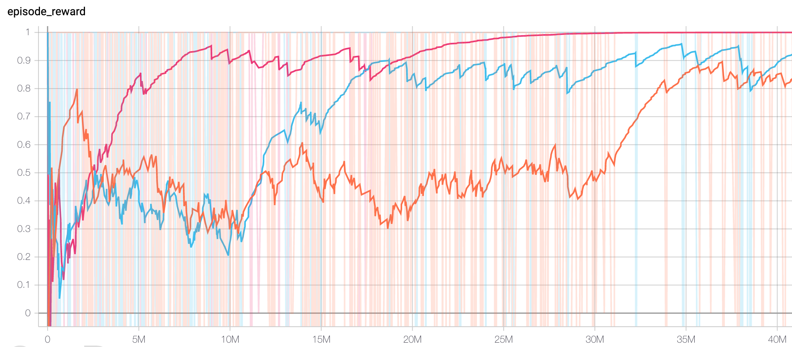

Reinforcement learning has been used to solve a number of challenging games recently. That said, there are many games that are as of yet unsolved or require a lot of domain knowledge in order to create intelligent agents. Pommerman, a bomberman clone ([further described here](/pom_info/)) provides a simple environment with fun and intuitive dynamics which are surprisingly deep.

# Problem Summary

How can we train agents capable of working and communicating together in a 2v2 competition? That is one of the core questions of the Pommerman competition this year (2019). Each agent must learn to not only manage aggressive strategies that can result in accidental suicide, it must also learn to predict and account for the actions of its teammate and enemies.

## The Challenge of Bombs
As mentioned in a few papers from our references, the unforgiving nature of bombs make for an inherently difficult learning environment. Bombs can kill not only your opponent but also yourself. The placement of a bomb is one action out of six available to the agent, so the training's early stages can resemble Russian Roulette. For a relatively unskilled agent, the placement of a bomb is most often associated with a large negative reward - that is, accidental suicide. Most learning agents therefore take away the lesson that one should never use bombs. However, this results in an unviable strategy of timidity, which, at best, can only result in a tie against a competent opponent. 

The secret to winning is to gain a healthy appetite for risk. The embrace of the risk of a bomb is a huge hump for any learning agent to get over, and is what makes Pommerman significantly harder to learn from than many other environments. It is also the attribute that inspired our first improvement described below.

# Our Approach

In general our approach can be summarized as: attempt to re-use existing trained agents and work from there. Failing that, we work on training agents from scratch.

## Existing Agent Use
The first place learning agent (4th overall) from last year's Pommerman competition at NeurIPS, [Navocado](https://arxiv.org/abs/1812.07297), has a much stronger and more general approach to reinforcement learning agent development, using an ensemble of agents and hyperparameter search with some ideas that are similar to [IMPALA](https://arxiv.org/abs/1802.01561) from Google's DeepMind, however it was nigh impossible to replicate their work with our time constraints as their code was not well documented and relies on a distributed computing setup with orchestrated Docker containers.

[MAGNet](https://arxiv.org/abs/1811.12557) was another reinforcement learning network for Pommerman we tried to use, but it also had serious compute requirements (it was an order of magnitude slower to train than other agents we tried) which we hoped to avoid with our own more lightweight approaches.

We spent a good portion of our time on [Skynet from Borealis AI](https://www.borealisai.com/en/blog/pommerman-team-competition-or-how-we-learned-stop-worrying-and-love-battle/) due to the quality of their code documentation. [Our codebase](https://github.com/Deep-Agents/Deep-Pommerman) was largely based around this agent which placed 2nd at NeurIPS 2018 for learning agents and 5th overall. However, as time went on, we found their strategy to be particularly unsatisfying, as it primarily relies on a [deterministic action filter](https://github.com/BorealisAI/pommerman-baseline) that prevents agents from making obviously poor choices most of the time (like bombing themselves). Unfortunately this results in agents that humans can consistently take advantage of after only a couple games. Teamwork is also only a loose concept, with Skynet team agents randomly thrashing/walking around if they get too close to each other. That said, we did train a few agents by combining their system with our improvements (see results below).

## Agents From Scratch

To build our own agents, we needed to investigate the most effective learning algorithms. We compared each learning algorithm on a simplified version of the environment that allowed us to compare algorithm performance quickly.

PPO tended to do the best, so we settled on it for all of the agents we attempted to train.

## Challenges

We faced a number of challenges such as poor code documentation, parallelization issues, overfitting to strategies, and trouble learning complex strategies. What our agents learned was also something we had to watch closely, as they would often make serious strategic errors and have a hard time unlearning those behaviors.

### Strategy Overfitting

Agents trained on environments that were too consistent tended to come up with trivial strategies (move left, then up, then place bomb). We found it necessary to randomize agent starting positions to account for this issue.

### Complex Strategy Learning

In general, our agents did not seem to learn very complex strategies. It is unclear whether this was due to insufficient training time, poor reward engineering, or neural networks that were not deep enough. One avenue of future research could be to quantify how large a neural network should be in relation to the difficulty of the task.

### Bomb Handling Depression

Skynet agents all would get depressed and stop placing bombs after one their teammates died. We believe this was due to the way "team spirit" rewards were handled, but did not find a good way of getting rid of this behavior.

### Exploiting bugs in enemies strategies
The built-in deterministic agent (SimpleAgent) has a few bugs in its AI that our agents learned to take advantage of, to cause it to commit suicide. If our trained agent sat in a certain spot in relation to the SimpleAgent, it would consistently stay in position. Eventually, it would place a bomb while continuing not to move, and end up killing itself. 

This is an example of our agent overfitting to the quirks of the enemy agent, as it is highly unlikely this precise strategy would work on any other opponent. We tried to avoid overfitting to any particular agent by varying the opponent agents. This is a sentiment that [DeepMind's AlphaStar team](https://deepmind.com/blog/article/AlphaStar-Grandmaster-level-in-StarCraft-II-using-multi-agent-reinforcement-learning) also seems to agree with:
>The key insight of the League is that playing to win is insufficient: instead, we need both main agents whose goal is to win versus everyone, and also exploiter agents that focus on helping the main agent grow stronger by exposing its flaws, rather than maximising their own win rate against all players. Using this training method, the League learns all its complex StarCraft II strategy in an end-to-end, fully automated fashion.

## Improvements

How can we improve on existing agents? Our answers focused primarily on the solutions below.

### Curricula

One of our primary successes was in the development of a curriculum of lessons on which agents had to achieve a certain level of compentency, before moving to successive lessons. We did this by varying the density of obstacles in the environment (such as destructible boxes and indestructible walls), agent starting positions, and opponent strategy/difficulty.

#### Board Size
In our experiments with the board size curriculum, the 11x11 board was walled up with indestructible blocks, leaving only a smaller central portion exposed for the agents to move within. Agents were progressively trained from a minimum board size of 4x4 up to the maximum 11x11 board. 

One advantage of implementing the board size curriculum in this manner was that the underlying observation space remained a constant 11x11 through all experiments, allowing the same agent to be trained and evaluated in different environment sizes. Below, we show the performance of the longest-trained agent in our experiments, at 300 million timesteps, on different board sizes.

The agent trained extensively on a 4x4 board still showed respectable performance on larger board sizes, exhibiting a _graceful_ decline. 

Another set of experiments was performed to compare the time to converge for agents trained from scratch, as a function of board size. Surprisingly, larger board sizes were associated with faster convergence. Below, the orange trace shows episode reward on a 4x4 board, blue on a 5x5 board, and pink on a 6x6 board.

On viewing some of the playouts of these games, we discovered that larger boards resulted in faster convergence due to a pathological behavior of the RandomAgent opponent, which chose actions randomly. On a larger board, it is less likely for an opponent to place a bomb near our trained agent. Our agent quickly learned to recede to a corner and wait for its opponent to commit suicide.

#### Environmental obstacles

We also varied the nature and density of the obstacles encountered by the agents in a progressive curriculum from few/no obstructions to occupying the majority of the board. 

Environmental board size curriculum refers to a sequence of 6 training lessons in a fixed-size board with increasing number of destructible boxes. We designed such a curriculum in a 6x6 board with 2, 4, 6, 8, 10, 12 destructible boxes respectively. We reward the agent for destruct each box, but the overall reward of destructing all of the boxes is only 1/10 of killing an opponent. Therefore, the agent would not stay too long on the board and risk its life on destructing boxes. We also reward the agent for finish quickly, that is, gives a small negative reward each timestep to the agent. In our initial training, we decided to train our agent against a static agent because we want our agent to learn to actually drop bomb and kill the opponent. Thus, our curriculum set up is the following:

<table class="tg">
  <tr>
    <th class="tg-c3ow">Lesson</th>
    <th class="tg-c3ow">Number of destructible boxes</th>
    <th class="tg-c3ow">board size</th>
    <th class="tg-c3ow">opponent</th>
  </tr>
  <tr>
    <td class="tg-c3ow">0</td>
    <td class="tg-c3ow">2</td>
    <td class="tg-c3ow">6x6</td>
    <td class="tg-c3ow">static agent</td>
  </tr>
  <tr>
    <td class="tg-c3ow">1</td>
    <td class="tg-c3ow">4</td>
    <td class="tg-c3ow">6x6</td>
    <td class="tg-c3ow">static agent</td>
  </tr>
  <tr>
    <td class="tg-c3ow">2</td>
    <td class="tg-c3ow">6</td>
    <td class="tg-c3ow">6x6</td>
    <td class="tg-c3ow">static agent</td>
  </tr>
  <tr>
    <td class="tg-c3ow">3</td>
    <td class="tg-c3ow">8</td>
    <td class="tg-c3ow">6x6</td>
    <td class="tg-c3ow">static agent</td>
  </tr>
  <tr>
    <td class="tg-c3ow">4</td>
    <td class="tg-c3ow">10</td>
    <td class="tg-c3ow">6x6</td>
    <td class="tg-c3ow">static agent</td>
  </tr>
  <tr>
    <td class="tg-c3ow">5</td>
    <td class="tg-c3ow">12</td>
    <td class="tg-c3ow">6x6</td>
    <td class="tg-c3ow">static agent</td>
  </tr>
</table>

Our curriculum in 11x11 board

After training each lesson on 5 million iterations, we get an agent that learns the "first taste of blood". It learns how to approach the agent, drop a bomb, kill the opponent, and escape to avoid killing itself. In addition, with randomization of the starting position of all of the agents and positions of the destructible boxes, it turns out that our trained agent can also find where the opponent is.

Out agent learns the first taste of blood

Reward curve

Even in a larger board with more boxes, our trained agent can still find a reasonably short path to the opponent and kill it efficiently.

### Network Architecture

Not all neural networks are equal! Some networks seemed to learn our curriculum with fewer episodes as compared to others. One key improvement we made was based on the positional relation of our observational data. Though our observation space is discrete, it can be thought of in a similar way as images, thus CNNs seem like a natural fit. 

However, the environment contained both spatial and non-spatial data. Stable Baselines, the RL library that we used, can't pass multiple data types from the environment to the model, as it currently does not support tuples. Thus, it seemed as though we would have to cut out the non-spatial information. We got around this limitation, however, by flattening all of the environment data, then splitting it back up and reconstructing the boards on the tensorflow side. The boards were fed into the convolutional layers, and the non-spatial data was appended to the first fully connected layer, as shown below. 

Training efficiency increased notably with our CNN architecture as compared to our fully connected layer architecture, and agents were able to make it farther into the curriculum before plateauing. 

# Results

We were able to beat the baseline deterministic agent, SimpleAgent, consistently with most of our trained agents. A detailed review of each agent's performance can be seen on our [Leaderboard](/leaderboards/). In the short playthrough below, the Skynet6407 team (red) beats a team of 2 SimpleAgents (blue) by trapping the first one, and then tricking the second one.

One of the Skynet agents we trained ourselves, Skynet6407, achieved better performance than the original Skynet competition agent (Skynet955). This was done without using existing checkpoints/weights, instead combining their reward structure with our curriculum. Skynet6407 never trained against Skynet955, so in matches against each other, both agents usually tie. This is likely because the action filter they use tends to make them over-cautious. One interesting note is that our version tends to complete matches faster/is slightly more aggressive--this is likely because we had it train so much against non-moving agents with fewer timesteps given per episode.

# Lessons Learned

[Reinforcement learning is hard!](https://www.alexirpan.com/2018/02/14/rl-hard.html)

## Parallelize!

If we had realized the importance of distributed computing and parallelization sooner, there's a good chance we could have gotten much better results (though it likely would have cost a lot more $$$). It's highly recommended that if you're serious about reinforcement learning (and not taking months to train decent agents), you start with the mindset of distributed computing and parallelization from the very beginning. One recommended RL scaling framework is [Ray's RLlib](https://ray.readthedocs.io/en/latest/rllib.html).

## Do Imitation Learning First! (If Possible)

Only towards the end did we realize how much more effective we could have been if we had started with an agent that learned to imitate from some known decent agent (human or deterministic). Only towards the end of our time did we discover [this work](https://github.com/eugene/pommerman) which went through many of the challenges we did and settled on imitation learning for decent performance. We likely could have imitated the best agents in last year's competition to get our baseline agents, and then trained on multi-agent communication from there. DeepMind again agrees on the importance of imitation learning for RL agents:
>Learning human strategies, and ensuring that the agents keep exploring those strategies throughout self-play, was key to unlocking AlphaStar’s performance. To do this, we used imitation learning – combined with advanced neural network architectures and techniques used for language modelling – to create an initial policy which played the game better than 84% of active players

# References

1. Resnick, Cinjon, et al. "Pommerman: A multi-agent playground." arXiv preprint arXiv:1809.07124 (2018).
1. Osogami, Takayuki, and Toshihiro Takahashi. "Real-time tree search with pessimistic scenarios." arXiv preprint arXiv:1902.10870 (2019).
1. Gao, Chao, et al. "Skynet: A Top Deep RL Agent in the Inaugural Pommerman Team Competition." arXiv preprint arXiv:1905.01360 (2019).
1. Malysheva, Aleksandra, Daniel Kudenko, and Aleksei Shpilman. "MAGNet: Multi-agent Graph Network for Deep Multi-agent Reinforcement Learning."
1. Peng, Peng, et al. "Continual match based training in Pommerman: Technical report." arXiv preprint arXiv:1812.07297 (2018).
1. Shah, Dhruv, Nihal Singh, and Chinmay Talegaonkar. "Multi-Agent Strategies for Pommerman."
1. Kartal, Bilal, et al. "Safer Deep RL with Shallow MCTS: A Case Study in Pommerman." arXiv preprint arXiv:1904.05759 (2019).
1. Resnick, Cinjon, et al. "Backplay:" Man muss immer umkehren"." arXiv preprint arXiv:1807.06919 (2018).
1. Kapoor, Sanyam. "Multi-agent reinforcement learning: A report on challenges and approaches." arXiv preprint arXiv:1807.09427 (2018).
1. Zhou, Hongwei, et al. "A hybrid search agent in pommerman." Proceedings of the 13th International Conference on the Foundations of Digital Games. ACM, 2018.
1. Gao, Chao, et al. "On hard exploration for reinforcement learning: A case study in pommerman." Proceedings of the AAAI Conference on 1. Artificial Intelligence and Interactive Digital Entertainment. Vol. 15. No. 1. 2019.
1. Perez-Liebana, Diego, et al. "Analysis of Statistical Forward Planning Methods in Pommerman." Proceedings of the AAAI Conference on 1. Artificial Intelligence and Interactive Digital Entertainment. Vol. 15. No. 1. 2019.
1. Kartal, Bilal, Pablo Hernandez-Leal, and Matthew E. Taylor. "Terminal Prediction as an Auxiliary Task for Deep Reinforcement Learning." Proceedings of the AAAI Conference on Artificial Intelligence and Interactive Digital Entertainment. Vol. 15. No. 1. 2019.
1. Vinyals, O., Babuschkin, I., Czarnecki, W.M. et al. Grandmaster level in StarCraft II using multi-agent reinforcement learning. Nature 575, 350–354 (2019)
